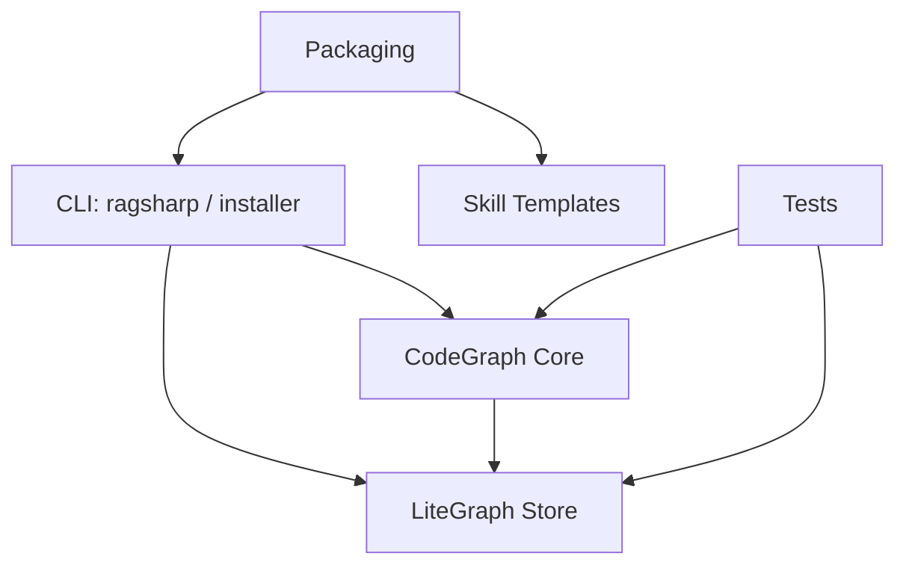
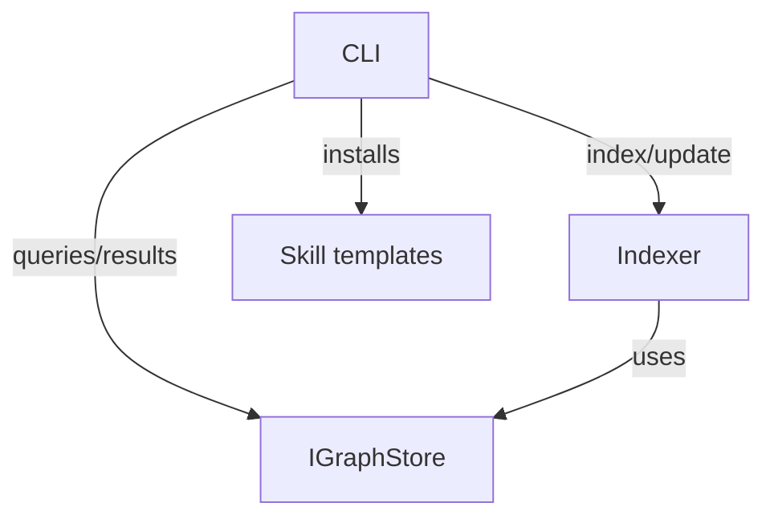
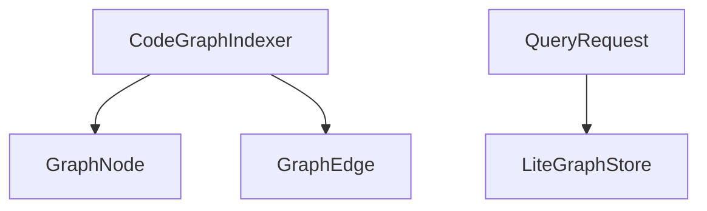

# Architecture Overview

This is the entry point for understanding RagSharp. Start here to find module boundaries, contracts, and key types, then follow the links to feature and development docs.

## System / module map

- CLI (`src/RagSharp.SkillInstaller`) – installs/uninstalls skills; will host graph commands.
- CodeGraph Core (`src/RagSharp.CodeGraph.Core`) – Roslyn indexing and graph model.
- LiteGraph Store (`src/RagSharp.CodeGraph.Store.LiteGraph`) – persistence layer.
- Packaging (`src/RagSharp.Packaging`) – bundles tools for NuGet.
- Skill templates (`assets/skill-templates/*`) – build/query workflows.
- Tests (`tests/`) – integration suites (CodeGraph, SkillInstaller).

## Interfaces / contracts

- `IGraphStore` interface in `RagSharp.CodeGraph.Core/IGraphStore.cs` implemented by `LiteGraphStore`.
- CLI commands call index/query/export flows using the store interface.
- Skill templates are installed by CLI to drive build/query automation.

## Key classes / types

- `CodeGraphIndexer` (`src/RagSharp.CodeGraph.Core/CodeGraphIndexer.cs`) builds nodes/edges from Roslyn.
- `GraphNode`/`GraphEdge`/`QueryRequest`/`QueryResult` (`GraphModels.cs`) define schema.
- `LiteGraphStore` (`src/RagSharp.CodeGraph.Store.LiteGraph/LiteGraphStore.cs`) stores and queries the graph.

## Navigation links
- Development docs: `docs/Development/CodeGraph.md`, `docs/Development/OutputSchema.md`, `docs/Development/QueryContract.md`, `docs/Development/Performance.md`, `docs/Development/Troubleshooting.md`.
- Overview wiki: `docs/Wiki/ProjectOverview.md`.
- Skills: `assets/skill-templates/build-code-graph/`, `assets/skill-templates/query-code-graph/`.

Keep this file short: diagrams + links only. Update diagrams and links first whenever boundaries change.
